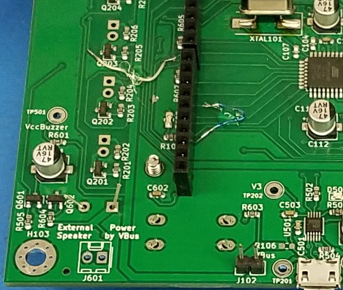
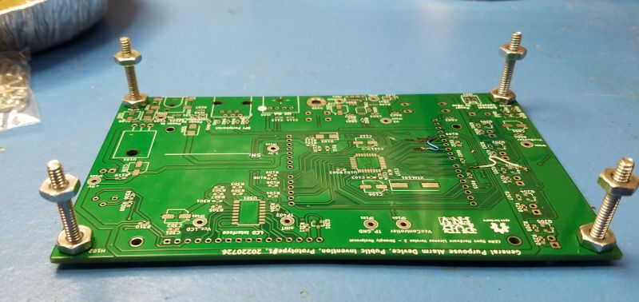
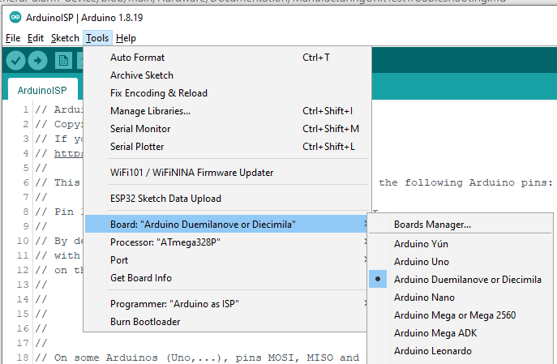
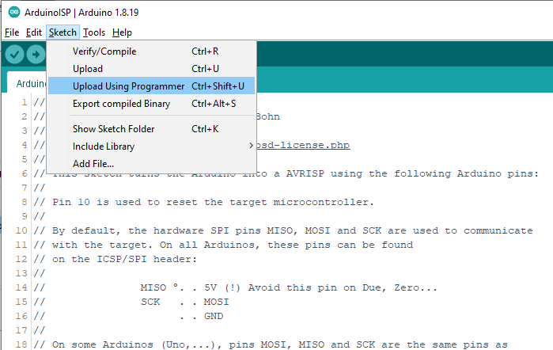
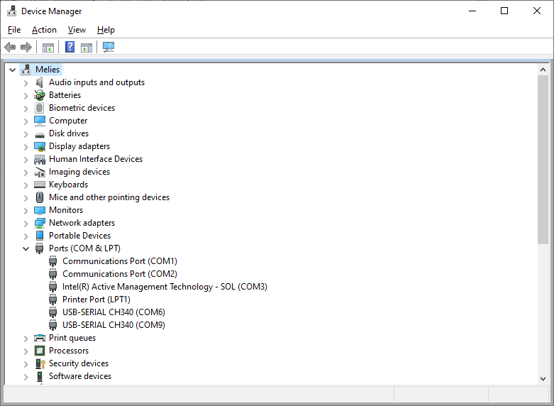

# Manufacturing and Unit Test Documentation, PCB Version 1 Prototype#1, 20220726
Assenbly Notes and Tips

Manufacturing test procedure for every unit

Unit (Design) verification tests on some units

GPAD Theory of Operation

Troubleshooting procedures

## Manufacturing test procedure for every unit

### Assembly Notes and Tips
Assumed that the assembly has the SMT components placed by the board manufacturer. Only through hole or other non SMT components are then placed by hand.
Write serial number on the PCB assembly. _Management of serial numbers is beyound the scope of this document. Each manufacturier must figure something out._

### Version 1 PCB nCS Rework Instructions
On front of PCB, mark and cut trace connecting D7 to nCS as shown.

As marked and cut with a small rotary bit.

On back of PCB, mark and cut trace connecting D10 to LIGHT0 nCS as shown.

Scrape solder resist from traces and solder a jumper wire to connect D7 to the trace connecting to R209 (To drive LIGHT4)
Scrape solder resist from traces and solder a jumper wire to connect D10 to the trace connecting to R404 (To nCS on J401)

Apply glue (We used hot melt) to mechanicaly secure the rework wires.

We made an assembly assistant / fixture by using a raw PCB with some long #6 screws and nuts to hold at the PCB mounting points. 

* The 16 pin header is fit and soldered on to the LCD sub module. Then the pins are placed through the GPAD PCB. Nylon spacers are placed at the four corners of the LCD sub module. Screws with nuts go through both boards and are torqued to **???4???** Inch-Pounds. Solder the LCD header pins into the GPAD PCB.
TIP: Using the assembly fixture the 16 pin header can be held flush to the LCD module to solder a center pin to start the process.

* Put Reset button, S101 into PCB from display side.
* Put Mute button, S401 into PCB from display side.
* Put Buzzer, BZ601 into PCB from display side.  Bending leads may help retain.
* Put Contrast pot, RV301 into PCB from display side.  Bending leads may help retain.

**NOTE** on the Version 1 PCB, the cathode flat marking on J105 is backwards. Place the RED LED in so that the flat cathode side is "in board".

Solder the through hole LEDs at locations D201-D205 and D105 with a **TBD** spacer, holding them up from the PCB by TBD inches. 

**NOTE** on the Version 1 PCB, the foot print for U301 is incorrect. It is too narrow for the part. See photograph of rework method of mounting.

### Electrical Tests
Measure and record by serial number the following electrical parameters.
Investigate and correct abnormal measurements before applying power.  Remove J102 and J103 and retain if present. Note where they should be replaced.
Start with no connections to the DUT (Device Under Test).

**Power Jack** Measure resistance to ground at J101 center pin as greater than **TBD** ohms.

**SPI Interface** Measure resistance to ground at J401 pin 5 as greater than **TBD** ohms.

**VinV net** Measure resistance to ground at TP102 as greater than **TBD** ohms.

**+5V net** Measure resistance to ground at TP103 +5 as greater than **TBD** ohms.

With a current limited supply set for 12V and maximum of **TBD** mA, apply power at J101 and note and record the un programed current.
(FYI, when unprogrammed, the first time power up current is normally about **TBD** mA.)

Check that the power LED D105 is lit and is RED.

**+5V net** Measure the voltage of the +5V Net at TP105.

(FYI, a programmed DUT that has been powered up, and with display back light on, Hold the reset switch and measure current as about **61** mA)

**Electrical Test Results Table**
<table>
  <tr><th>DUT Serial Number</th> <th>R@PowerJack</th> <th>R@SPI Interface</th> <th>R@Vin net</th> <th>R@5V net</th> <th>UnProgramCurrent</th> <th>Volt@+5 TP103</th><th>FullCurrent</th> <th>Notes</th></tr>
  <tr><td>01</td> <td>???</td> <td>???</td> <td>???</td> <td>???</td> <td>???</td> <td>???</td> <td>???</td> </tr>
  <tr><td>02</td> <td> >2Meg</td> <td>>2Meg</td> <td>>2Meg</td> <td>>2Meg</td> <td> 61 mA with LCD back light on</td> <td>5.04V</td> <td>119 mA</td> <td>Not measure un programed.</td> </tr>
  <tr><td>03</td> <td>???</td> <td>???</td> <td>???</td> <td>???</td> <td>???</td> <td>???</td> <td>???</td> <td>???</td> </tr>
  <tr><td>04</td> <td>???</td> <td>???</td> <td>???</td> <td>???</td> <td>???</td> <td>???</td> <td>???</td> <td>???</td> </tr>
  <tr><td>05</td> <td>???</td> <td>???</td> <td>???</td> <td>???</td> <td>???</td> <td>???</td> <td>???</td> <td>???</td> </tr>
  <tr><td>06</td> <td>???</td> <td>???</td> <td>???</td> <td>???</td> <td>???</td> <td>???</td> <td>???</td> <td>???</td> </tr>
  <tr><td>07</td> <td>???</td> <td>???</td> <td>???</td> <td>???</td> <td>???</td> <td>???</td> <td>???</td> <td>???</td> </tr>
  <tr><td>08</td> <td>???</td> <td>???</td> <td>???</td> <td>???</td> <td>???</td> <td>???</td> <td>???</td> <td>???</td> </tr>
  <tr><td>09</td> <td>???</td> <td>???</td> <td>???</td> <td>???</td> <td>???</td> <td>???</td> <td>???</td> <td>???</td> </tr>
  <tr><td>10</td> <td>???</td> <td>???</td> <td>???</td> <td>???</td> <td>???</td> <td>???</td> <td>???</td> <td>???</td> </tr>
  <tr><td>11</td> <td>???</td> <td>???</td> <td>???</td> <td>???</td> <td>???</td> <td>???</td> <td>???</td> <td>???</td> </tr>
  <tr><td>12</td> <td>???</td> <td>???</td> <td>???</td> <td>???</td> <td>???</td> <td>???</td> <td>???</td> <td>???</td> </tr>
  <tr><td>13</td> <td>???</td> <td>???</td> <td>???</td> <td>???</td> <td>???</td> <td>???</td> <td>???</td> <td>???</td> </tr>
  <tr><td>14</td> <td>???</td> <td>???</td> <td>???</td> <td>???</td> <td>???</td> <td>???</td> <td>???</td> <td>???</td> </tr>
  <tr><td>15</td> <td>???</td> <td>???</td> <td>???</td> <td>???</td> <td>???</td> <td>???</td> <td>???</td> <td>???</td> </tr>  
</table>

### Load Firmware
Use an Arduino UNO as an ISP (Incircuit Serial Programmer).  
  
Connect the ISP UNO to the DUT as follows:
<table>
  <tr>
    <th>SPI UNO</th>
    <th>to DUT</th>
    <th>Note</th>
  </tr>
  <tr>
    <td>D13</td>
    <td>D13</td>
    <td>???</td>
  </tr>
<tr>
    <td>D12</td>
    <td>D12</td>
    <td>???</td>
  </tr>
<tr>
    <td>D11</td>
    <td>D11</td>
    <td>???</td>
  </tr>
<tr>
    <td>D10</td>
    <td>Reset</td>
    <td>???</td>
  </tr>
  <tr>
    <td>GND</td>
    <td>GND</td>
    <td>???</td>
  </tr>
  
</table>

Load the sketch "ArduinoISP".  

Select the serial port for the ISP, UNO and compile and upload with the "ArduinoISP" by pressing **<Ctrl>U**. 

Select the board type to "Arduino Duemilanove..." .  

Select the Processor type to "ATmega328P" .  

Select the programmer type.  

In the Arduino IDE, open the file "GPAD_Factory_Test.ino".  
  Using the Arduino IDE, instruct the ISP UNO to Upload to the DUT the "GPAD_Factory_Test.ino"

Watch the progress bar in the IDE and look for success with the message "Done uploading" in the blue status bar.
  
Connect a USB cable to the DUT. Note the COM port enumerated in Device Manager Ports(COM&LPT) drop down
  
  
Open a terminal to the COM port of the DUT and set for appropriate BAUD rate. 
Press the reset switch on the DUT and the LCD display should display a message. The terminal should display a boot message too. This example is of a RealTerminal connected to the DUT.
  
  
  
  Observe the current on the DUT. Press the Mute Switch S601 and the white LEDs D201-D205 should light. The Buzzer will make a sound. Record this full current in the table above.
   
  
# TO DO Future tests:  
 * Connect the DUT to an SPI controller and test SPI interface.  
 * Connect the DUT to an I2C peripheral device and test the I2C daisy chain output.  
 * Walking One test of LEDs D201-D205.   
 * Test for Amplitude Modulation of Buzzer.  
  

##  Unit (Design) verification tests on some units
  On DUT SN @, Lee has modified the Factory Test Firmware to test the buzzer at 4KHz which is the frequency for which it us specified.
Using my Galaxy 7 phone and a free sound meter level (with absolutely no calibration) I measure over 60 db at about 12" from buzzer. Maxumum current into DUT was 110mA.  
  
  
  
  Buzzer test with 3"x4.875" 8 Ohm speaker at 1KHz, and 130 Hz and much louder 76db and 67 dB respectivly.  Maxumum current into DUT was 220mA.
  
  
  **Configuration Version 1 Assemblies**
  Tracking electrical and mechanical configuration of Version 1 GPAD assemblies and their locations
<table>
  <tr><th>DUT Serial Number</th> <th>Rework 1</th> <th>Rework 2</th> <th>Rework 3</th> <th>Rework 4</th> <th>Rework 5</th> <th>Rework 6</th><th>Rework 7</th> <th>Location (Person and contact information)</th></tr>
  <tr><td>01</td> <td>???</td> <td>???</td> <td>???</td> <td>???</td> <td>???</td> <td>???</td> <td>???</td> </tr>
  <tr><td>02</td> <td> >SPI cCS to D10, LIGHT4 D7</td> <td>TBD</td> <td>TBD</td> <td>TBD</td> <td>TBD</td>  <td>???</td> <td>???</td> <td>Lee, Maryville TN</td></tr>
  <tr><td>03</td> <td>???</td> <td>???</td> <td>???</td> <td>???</td> <td>???</td> <td>???</td> <td>???</td> <td>Lee, Maryville TN</td> </tr>
  <tr><td>04</td> <td>???</td> <td>???</td> <td>???</td> <td>???</td> <td>???</td> <td>???</td> <td>???</td> <td>Lee, Maryville TN</td> </tr>
  <tr><td>05</td> <td>???</td> <td>???</td> <td>???</td> <td>???</td> <td>???</td> <td>???</td> <td>???</td> <td>Lee, Maryville TN</td> </tr>
  <tr><td>06</td> <td>???</td> <td>???</td> <td>???</td> <td>???</td> <td>???</td> <td>???</td> <td>???</td> <td>Lee, Maryville TN</td> </tr>
  <tr><td>07</td> <td>???</td> <td>???</td> <td>???</td> <td>???</td> <td>???</td> <td>???</td> <td>???</td> <td>???</td> </tr>
  <tr><td>08</td> <td>???</td> <td>???</td> <td>???</td> <td>???</td> <td>???</td> <td>???</td> <td>???</td> <td>???</td> </tr>
  <tr><td>09</td> <td>???</td> <td>???</td> <td>???</td> <td>???</td> <td>???</td> <td>???</td> <td>???</td> <td>???</td> </tr>
  <tr><td>10</td> <td>???</td> <td>???</td> <td>???</td> <td>???</td> <td>???</td> <td>???</td> <td>???</td> <td>???</td> </tr>
  <tr><td>11</td> <td>???</td> <td>???</td> <td>???</td> <td>???</td> <td>???</td> <td>???</td> <td>???</td> <td>???</td> </tr>
  <tr><td>12</td> <td>???</td> <td>???</td> <td>???</td> <td>???</td> <td>???</td> <td>???</td> <td>???</td> <td>???</td> </tr>
  <tr><td>13</td> <td>???</td> <td>???</td> <td>???</td> <td>???</td> <td>???</td> <td>???</td> <td>???</td> <td>???</td> </tr>
  <tr><td>14</td> <td>???</td> <td>???</td> <td>???</td> <td>???</td> <td>???</td> <td>???</td> <td>???</td> <td>???</td> </tr>
  <tr><td>15</td> <td>???</td> <td>???</td> <td>???</td> <td>???</td> <td>???</td> <td>???</td> <td>???</td> <td>???</td> </tr>  
</table>

