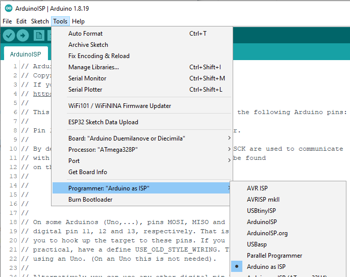
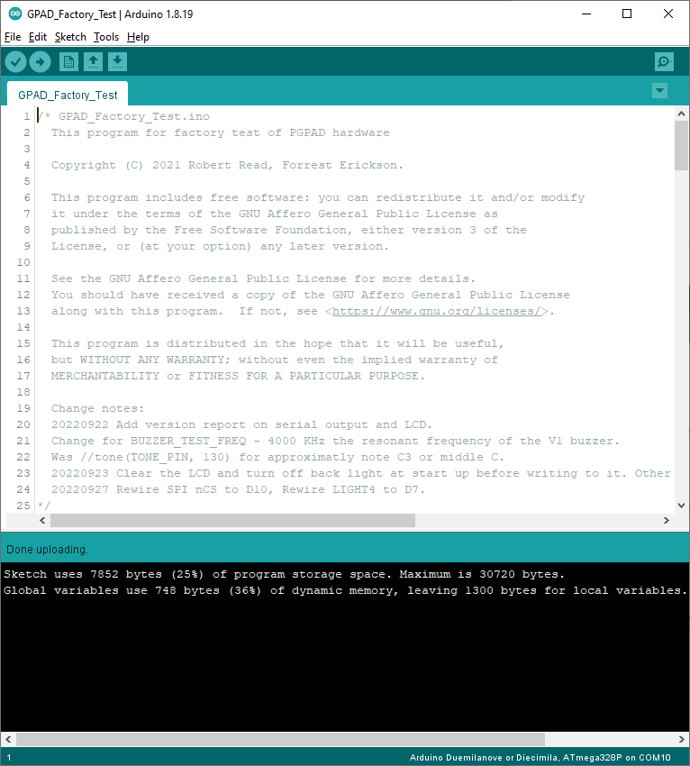
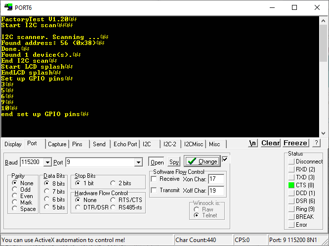

# Manufacturing and Unit Test Documentation, PCB Version 1 Prototype#1, 20220726
Setions below
* Manufacturing test procedure for every unit  
**Assenbly Notes and Tips  
** Unit (Design) verification tests on some units  
** Configuration Version 1 Assemblies 
* GPAD Theory of Operation  
* Troubleshooting procedures  

## Manufacturing test procedure for every unit

### Assembly Notes and Tips

Assumed that the assembly has the SMT components placed by the board manufacturer. Only through hole or other non SMT components are then placed by hand.
Write serial number on the PCB assembly. _Management of serial numbers is beyound the scope of this document. Each manufacturier must figure something out._

### Version 1 PCB nCS Rework Instructions
1. Rework 1, D7 and D10 Swapp  
The SPI nCS signal must be reworked to connect from D7 to D10 and the LIGHT4 from D10 to D7.  
Naming convention for board side. The naming follows the KiCAD convention and additionaly the U102 Controller is on the front side. The LCD is on the back side. This document may refer to the Controller side and LCD side as that may be more obvious to the casual user.
On front Controller side of of PCB, mark and cut trace connecting D7 to nCS as shown.  
  

As marked and cut with a small rotary bit.  

  

On back or LCD side of the PCB, mark and cut trace connecting D10 to LIGHT0 nCS as shown.  

<a href="V1CutD10Trace.gif"> Locate cut.</a>  

As marked and cut with a small rotary bit.  

<a href="CutLocationD10Trace.jpg"> As cut.</a>  
  
On the front or Controller side, scrape solder resist from traces and solder a jumper wire to connect D7 to the trace connecting to R209 (To drive LIGHT4)

Scrape solder resist from traces and solder a jumper wire to connect D10 to the trace connecting to R404 (To nCS on J401)  
<a href="ScrapeTraces.jpg"> Scraped and with wires.</a>  

Apply glue (We used hot melt) to mechanicaly secure the rework wires.  
<a href="GlueWires.jpg"> Glued rework wires.</a>  
**Important, update the configuration table below to reflect this rework to the PCB**  
Follow the pattern for tracking this update found in Configuration Version 1 Assemblies

Install the UNO headers at four locations. After soldering, cut the pins so that they will not intefer with the LCD display to be installed soon.  
<a href="TrimUNOHeaders.jpg"> Trimming header pins.</a>  

2. Rework 2 for DTR to Reset.
Reference the issues **Connect DTR on USB to Serial IC to The ATmega328 Reset Through Capacitor Like Arduino Nano Schematic #116** and **Can't upload firmware #85**
A rework involving moving C601 to a pin on S101 (Reset switch) and using 30 AWG wire wrap wire to connect the other side of C601 to U501 Pin 4 (DTR).  
Secure wire with hot melt glue or similar.  
Image of Rework 2  
  

Update the configuration table below to reflect these two reworks by serial number.  

**Image of Rework 3 Remove and Relocate R103 and D102**
R103 and D102 load the SPI SCK line and so R103 should be removed. 
To better approximate the Version 2 PCB relocate these parts to become the version 2 components R112 and D106
Screen shot schematic for relocated Resistor and LED on Version 2 PCB.

**Photographs of LED relocation rework on a Version 1 PCB.**
First remove solder mask on trace and ground  
  
Then solder cathode of LED to ground, solder the resistor to the LED and to the trace to A3.  
  

**IMPORTANT: Afer any rework, update the configuration table below to reflect these reworks by serial number.  **

_End Rework Instructions _

### An Assembly Fixture
We made an assembly assistant / fixture by using a raw PCB with some long #6 screws and nuts to hold at the PCB mounting points. 

* LCD Bezel Grounding.  
On the LCD module locate the J1 and J2 solder pads which if soldered ground the bezel.   
<a href="LocateJ1J2.jpg"> View of J1 and J2.</a>  
Solder them.  
<a href="SolderJ1J2.jpg"> Solder on of J1 and J2.</a>  
As soldered.

* The 16 pin header is fit and soldered on to the LCD sub module. Then the pins are placed through the GPAD PCB. Nylon spacers are placed at the four corners of the LCD sub module. Screws with nuts go through both boards and are torqued to **???4???** Inch-Pounds. Solder the LCD header pins into the GPAD PCB.
TIP: Using the assembly fixture the 16 pin header can be held flush to the LCD module to solder a center pin to start the process.  
<a href="AssemblyFixtureView2.jpg"> Assembly Fixture View 2</a>  
<a href="HeaderToLCD.jpg"> View of holding header to LCD.</a>  

* Put Reset button, S101 into PCB from display side.
* Put Mute button, S401 into PCB from display side.
* Put Buzzer, BZ601 into PCB from display side.  Bending leads may help retain.
* Put Contrast pot, RV301 into PCB from display side.  Bending leads may help retain.  
<a href="LCD_SideComponents.jpg"> LCD side components installed.</a>  

**NOTE** on the Version 1 PCB, the cathode flat marking on J105 is backwards. Place the RED LED in so that the flat cathode side is "in board".

Solder the through hole LEDs at locations D201-D205 and D105 with a **TBD** spacer, holding them up from the PCB by *TBD* inches.  

<a href="LEDsCoPlainer.jpg"> Till an enclosure is finalized, solder LEDs so that the lens is co plainer with the LCD bezel.</a> 

**NOTE** on the Version 1 PCB, the foot print for U301 is incorrect. It is too narrow for the part. To mount the part the leads must be formed by bending downard and flattened so that the part stands "tip toe" on the PCB pads.  Apply some flux to the pads and to the leads. With a small tip soldering iron anchor diaginal pins so that the part is well centered and then solder all pins.
See photograph of rework method of mounting.  
<a href="U301OnStilts.jpg"> U301 on tip toe, pin 16 view. </a>
<a href="U301OnStiltsB.jpg"> U301 on tip toe, pin one view. </a>
<a href="U301OnStiltsC.jpg"> U301 on tip toe, end view </a>

### Electrical Tests
Measure and record by serial number the following electrical parameters.
Investigate and correct abnormal measurements before applying power.  Remove J102 and J103 and retain if present. Note where they should be replaced.
Start with no connections to the DUT (Device Under Test).

**Power Jack** Measure resistance to ground at J101 center pin as greater than **TBD** ohms.

**SPI Interface** Measure resistance to ground at J401 pin 5 as greater than **TBD** ohms.

**VinV net** Measure resistance to ground at TP102 as greater than **TBD** ohms.

**+5V net** Measure resistance to ground at TP103 +5 as greater than **TBD** ohms.

With a current limited supply set for 12V and maximum of **TBD** mA, apply power at J101 and note and record the un programed current.
(FYI, when unprogrammed, the first time power up current is normally about **TBD** mA.)

Check that the power LED D105 is lit and is RED.

**+5V net** Measure the voltage of the +5V Net at TP105.

(FYI, a programmed DUT that has been powered up, and with display back light on, Hold the reset switch and measure current as about **61** mA)

**Electrical Test Results Table**

In Tennessee:
* All resistance measured on 20Meg scale except R@5V net measured on 2K scale. Multi meter EMCO Model DMR-3800 unless noted.   
* All current measured 200mA scale. Multi meter EMCO Model DMR-3800 unless noted.  

<table style="background-color:#DDDDEE">
  <tr><th>DUT Serial Number</th> <th>R@PowerJack</th> <th>R@SPI Interface</th> <th>R@Vin net</th> <th>R@5V net</th> <th>UnProgramCurrent</th> <th>Volt@+5 TP103</th><th>FullCurrent mA</th> <th>Vo Volts</th> <th>Notes</th></tr>
  <tr><td>01</td> <td>???</td> <td>???</td> <td>???</td> <td>???</td> <td>???</td> <td>???</td> <td>???</td> </tr>
  <tr><td>02</td> <td> >2Meg</td> <td>>2Meg</td> <td>>2Meg</td> <td>>2Meg</td> <td> 61 mA with LCD back light on</td> <td>5.04V</td> <td>119 mA</td> <td>1.29</td> <td>Not measure un programed.</td> </tr>
  <tr><td>03</td> <td>1.5Meg</td> <td>Open</td> <td>490K</td> <td>1.052K</td> <td>68.4 LCD ON</td> <td>5.03</td> <td>118</td> <td>1.29</td> <td> </td> </tr>
  <tr><td>04</td> <td>1.5Meg</td> <td>Open</td> <td>320K</td> <td>1.052K</td> <td>68.5 LCD ON</td> <td>5.02</td> <td>118</td> <td>1.30</td> <td> </td> </tr>
  <tr><td>05</td> <td>980K</td>   <td>Open</td> <td>500K</td> <td>1.052K</td> <td>68.8 LCD ON</td> <td>5.03</td> <td>118</td> <td>1.33</td> <td> </td> </tr>
  <tr><td>06</td> <td>1.3Meg</td> <td>Open</td> <td>250K</td> <td>1.052K</td> <td>68.7 LCD ON</td> <td>5.03</td> <td>118</td> <td>Vo=1.29</td> <td> </td> </tr>
  <tr><td>07</td> <td>???</td> <td>???</td> <td>???</td> <td>???</td> <td>???</td> <td>???</td> <td>???</td> <td>???</td> </tr>
  <tr><td>08</td> <td>???</td> <td>???</td> <td>???</td> <td>???</td> <td>???</td> <td>???</td> <td>???</td> <td>???</td> </tr>
  <tr><td>09</td> <td>???</td> <td>???</td> <td>???</td> <td>???</td> <td>???</td> <td>???</td> <td>???</td> <td>???</td> </tr>
  <tr><td>10</td> <td>???</td> <td>???</td> <td>???</td> <td>???</td> <td>???</td> <td>???</td> <td>???</td> <td>???</td> </tr>
  <tr><td>11</td> <td>???</td> <td>???</td> <td>???</td> <td>???</td> <td>???</td> <td>???</td> <td>???</td> <td>???</td> </tr>
  <tr><td>12</td> <td>???</td> <td>???</td> <td>???</td> <td>???</td> <td>???</td> <td>???</td> <td>???</td> <td>???</td> </tr>
  <tr><td>13</td> <td>???</td> <td>???</td> <td>???</td> <td>???</td> <td>???</td> <td>???</td> <td>???</td> <td>???</td> </tr>
  <tr><td>14</td> <td>???</td> <td>???</td> <td>???</td> <td>???</td> <td>???</td> <td>???</td> <td>???</td> <td>???</td> </tr>
  <tr><td>15</td> <td>???</td> <td>???</td> <td>???</td> <td>???</td> <td>???</td> <td>???</td> <td>???</td> <td>???</td> </tr>  
</table>

### Load Firmware
#### Load Bootloader
Use an Arduino UNO as an ISP (Incircuit Serial Programmer) which will load the boot loader into the DUT.
Cable Connect the ISP UNO to the DUT as follows:
<table style="background-color:#DDDDEE">
  <tr>    <th>Signal Name </th> <th>SPI UNO</th> <th>to DUT</th> <th>RJ12 Pin</th>  </tr>
  <tr>    <th>SPI CLK  </th> <td>D13</td>    <td>D13</td>    <td>4</td> </tr>
  <tr>    <th>SPI CIPO </th> <td>D12</td>    <td>D12</td>    <td>6</td>  </tr>
  <tr>    <th>SPI COPI </th> <td>D11</td>    <td>D11</td>    <td>2</td>  </tr>
  <tr>    <th>nCS      </th> <td>D10</td>    <td>D10</td>    <td>1</td>  </tr>
  <tr>    <th>GND      </th> <td>GND</td>    <td>GND</td>    <td>3</td>  </tr>
  <tr>    <th>POWER    </th> <td>+5</td>     <td>+5</td>     <td>5</td>  </tr>
</table>

  Wiring of the UNO to the DUT.
Place a Jumper on the DUT from D10 to Reset
  Jumper for D10 to Reset.

Load into the IDE the sketch "ArduinoISP".  

To load into the UNO, Select the serial port for the UNO and compile and upload with the "ArduinoISP" by pressing **<Ctrl>U**. 

Setup the UNO to burn the boot loader into the GPAD target.
Select the board type (Boot loader type) to "Arduino Duemilanove..." .  

Select the Processor type to "ATmega328P" .  

Select the programmer type.  

In the Arduino IDE, select TOOLS > Burn Bootloader .  

  
Watch the progress bar in the IDE and look for success with the message "????Done ???" in the blue status bar.

#### Load Factory Test Firmware.
Connect a USB cable to the DUT. Note the COM port enumerated in Device Manager Ports(COM&LPT) drop down
  

In the Arduino IDE, open the a new file "GPAD_Factory_Test.ino".  
Set the IDE for the COM port of the DUT.
  Using the Arduino IDE, compiel and upload to the DUT the "GPAD_Factory_Test.ino"

Watch the progress bar in the IDE and look for success with the message "Done uploading" in the blue status bar. 
  
Open a terminal to the COM port of the DUT and set for appropriate BAUD rate. 
Press the reset switch on the DUT and the LCD display should display a message. The terminal should display a boot message too. This example is of a RealTerminal connected to the DUT.
  
  
  
  Observe the current on the DUT. Press the Mute Switch S601 and the white LEDs D201-D205 should light. The Buzzer will make a sound. Record this full current in the table above.
   
  
# TO DO Future tests:  
 * Connect the DUT to an SPI controller and test SPI interface.  
 * Connect the DUT to an I2C peripheral device and test the I2C daisy chain output.  
 * Walking One test of LEDs D201-D205.   
 * Test for Amplitude Modulation of Buzzer.  
  

##  Unit (Design) verification tests on some units
  On DUT SN @, Lee has modified the Factory Test Firmware to test the buzzer at 4KHz which is the frequency for which it us specified.
Using my Galaxy 7 phone and a free sound meter level (with absolutely no calibration) I measure over 60 db at about 12" from buzzer. Maxumum current into DUT was 110mA.  
  
  
  
  Buzzer test with 3"x4.875" 8 Ohm speaker at 1KHz, and 130 Hz and much louder 76db and 67 dB respectivly.  Maxumum current into DUT was 220mA.
  
  **[Configuration Version 1 Assemblies](#configurations)**  
  Tracking electrical and mechanical configuration of Version 1 GPAD assemblies and their locations
 <table style="background-color:#DDDDEE">
  <tr><th>DUT Serial Number</th> <th>Rework 1 (D7 and D10 swapp)</th> <th>Rework 2 (DTR to Reset)</th> <th>Rework 3 Remove and Relocate R103 and D102</th> <th>Rework 4</th> <th>Rework 5</th> <th>Rework 6</th><th>Rework 7</th> <th>Location history (Person and contact information)</th></tr>
  <tr><td>01</td> <td>???</td> <td>???</td> <td>???</td> <td>???</td> <td>???</td> <td>???</td>  <td>???</td> <td>September2022 Lawarence, OK, Seyi in AU December 2022</td> </tr>
  <tr><td>02</td> <td>SPI nCS to D10, LIGHT4 D7</td> <td>DTR to Reset Nov 2022</td> <td>Reloacte D102 etc. 20221220</td> <td>TBD</td> <td>TBD</td>  <td>???</td> <td>???</td> <td>202209 Lee, Maryville TN</td></tr>
  <tr><td>03</td> <td>SPI nCS to D10, LIGHT4 D7</td> <td>???</td> <td>???</td> <td>???</td> <td>???</td> <td>???</td> <td>???</td> <td>202209 Lee, Maryville TN</td> </tr>
  <tr><td>04</td> <td>SPI nCS to D10, LIGHT4 D7</td> <td>???</td> <td>???</td> <td>???</td> <td>???</td> <td>???</td> <td>???</td> <td>202209 Lee, Maryville TN</td> </tr>
  <tr><td>05</td> <td>SPI nCS to D10, LIGHT4 D7</td> <td>???</td> <td>???</td> <td>???</td> <td>???</td> <td>???</td> <td>???</td> <td>202209 Lee, Maryville TN</td> </tr>
  <tr><td>06</td> <td>SPI nCS to D10, LIGHT4 D7</td> <td>DTR to Reset 20221220</td> <td>Reloacte D102 etc. 20221220</td> <td>???</td> <td>???</td> <td>???</td> <td>???</td> <td>202209 Lee, Maryville TN</td> </tr>
  <tr><td>07</td> <td>???</td> <td>???</td> <td>???</td> <td>???</td> <td>???</td> <td>???</td> <td>???</td> <td>Lawarence, OK</td> </tr>
  <tr><td>08</td> <td>???</td> <td>???</td> <td>???</td> <td>???</td> <td>???</td> <td>???</td> <td>???</td> <td>Lawarence, OK</td> </tr>
  <tr><td>09</td> <td>???</td> <td>???</td> <td>???</td> <td>???</td> <td>???</td> <td>???</td> <td>???</td> <td>Lawarence, OK</td> </tr>
  <tr><td>10</td> <td>???</td> <td>???</td> <td>???</td> <td>???</td> <td>???</td> <td>???</td> <td>???</td> <td>Lawarence, OK</td> </tr>
  <tr><td>11</td> <td>???</td> <td>???</td> <td>???</td> <td>???</td> <td>???</td> <td>???</td> <td>???</td> <td>Lawarence, OK</td> </tr>
  <tr><td>12</td> <td>???</td> <td>???</td> <td>???</td> <td>???</td> <td>???</td> <td>???</td> <td>???</td> <td>Lawarence, OK</td> </tr>
  <tr><td>13</td> <td>???</td> <td>???</td> <td>???</td> <td>???</td> <td>???</td> <td>???</td> <td>???</td> <td>Lawarence, OK</td> </tr>
  <tr><td>14</td> <td>???</td> <td>???</td> <td>???</td> <td>???</td> <td>???</td> <td>???</td> <td>???</td> <td>Lawarence, OK</td> </tr>
  <tr><td>15</td> <td>???</td> <td>???</td> <td>???</td> <td>???</td> <td>???</td> <td>???</td> <td>???</td> <td>Lawarence, OK</td> </tr>  
</table>

## GPAD Theory of Operation  
The GPAD is based on an Arduino UNO design with a CH340 USB to Serial adapter which enumerates on a USB port as a CDC aka Windows COM port (In linux systems a port /dev/ttyUSBn where "n" is a number).
  
The GPAD is a SPI Peripherial device and will be controlled by another computer which will be a Controller.  

The GPAD Can be configured to get power from three ways. One is a barrel jack (2.1mm center positive) at 7-12Vdc, A second through the RJ12 connector from the Controller at 7-12Vdc is with a jumper on J103 or resistor at R107, and the third for low current applications only is the USB buss by adding Jumper J102 or zero ohm resistor at R106.  

The GPAD generaly is controlled by an SPI Controller but through the USB port debug information can be watched and some TBD control is also possible.

## Troubleshooting procedures  
Compare and contrast operation with a normal device when ever possible.
Check **TBD** for history of other faults and their fixes.
